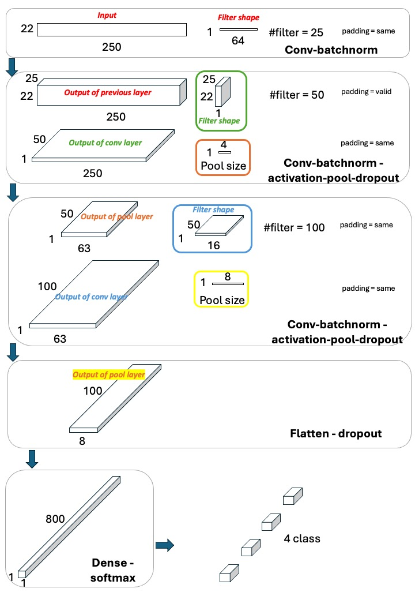
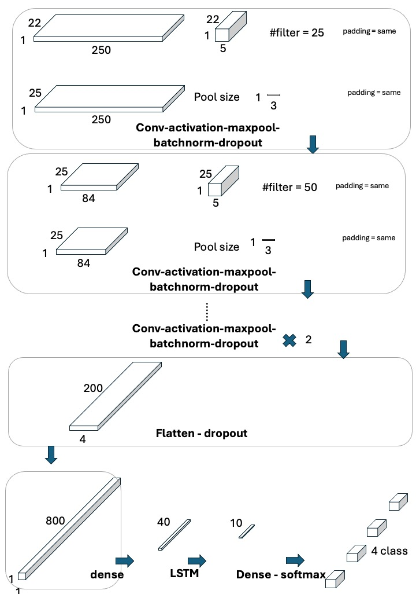

# Project Title

Neural Network and Deep Learning Course project:
EEG-classification

## Table of Contents
- [Project Description](#project-description)
- [Features](#features)
- [Installation](#installation)

## Project Description

This study investigates the efficacy of various neural network architectures in classifying electroencephalography (EEG) data in order to predict the task that a subject has intended or performed. EEG data, comprising 2115 examples from 22 electrodes over 1000 time bins, presents unique challenges in capturing both spatial and temporal dimensions. 

I explored and compared three classes of architectures: **Convolutional Neural Networks (CNNs)**, **Long Short-Term Memory (LSTM)**, and a **hybrid of CNN and LSTM**. Initial experiments focused on generalization capabilities across different subjects while a model trained based on a single subject. Results indicated the necessity of training on a broad subject pool for effective generalization. Further analysis revealed the importance of selecting appropriate temporal cutoffs to improve model performance. I discovered that CNN-based architectures, specifically CNN1 and a hybrid model, outperformed others, achieving test accuracies above 70%. The study also examined various configurations of layer sequencing and hyperparameters. While LSTMs alone were less effective, likely due to the spatialtemporal complexity of EEG data, hybrid models integrating CNNs showed potential, although they did not consistently outperform standalone CNN models. These findings underscore the complexity of EEG data classification and the potential of tailored neural network architectures in improving accuracy and generalization.

## Features
- Feature 1: CNN1.ipynb and CNN2.ipynb: In CNN1, initially temporal dimension is convolved followed by convolution in spatial dimension (channels) followed by average pool in temporal dimension. Finally temporal dimension convolved and pooled. However, in CNN2, the spatial dimension is just convolved in the beginning through the depth of the filters.

- Feature 2: Hybrid CNN-LSTM-1 is same as CNN-1 for which Dense(40) and LSTM(10) are also added before last dense (4, softmax) layer.
- Feature 3: Hybrid CNN-LSTM-2 is same as CNN-2 for which Dense(40) and LSTM(10) are also added before last dense (4, softmax) layer.

- Feature 4: Final_report.pdf is the report and includes the method and findings of this project.

## Installation

Not required

